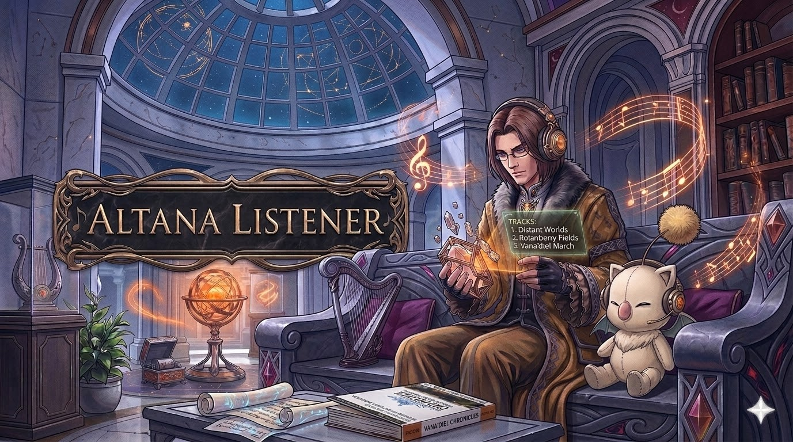

# 🎵 AltanaListener

**The ultimate, open-source audio player for Final Fantasy XI.**

Welcome to AltanaListener! If you want to sit back, relax, and listen to the beautiful music of Vana'diel without logging into the game, you are in the right place. 

## 📖 Why AltanaListener?
You might be familiar with a project I work on called [AltanaViewer](https://github.com/voliathon/AltanaViewer). While that tool has its uses, it is closed source and notoriously has issues when it comes to playing music. If your goal is simply to listen to FFXI songs, AltanaViewer is a subpar solution. 

**AltanaListener** was built from the ground up to fix that. It is completely open-source, highly stable, and engineered purely for the best audio experience possible.

## ✨ Features
We have built a completely custom audio engine and UI to give you full control over your FFXI music library:

* **🔍 Auto-Discovery:** Automatically finds your Final Fantasy XI installation and loads all the background music (`.bgw` files) instantly.
* **⭐ Favorites System:** Easily star your favorite tracks and filter your list with a single click.
* **📁 Custom Playlists:** Right-click any track to build and manage your own custom playlists (e.g., "Boss Battles", "Town Themes") using the dedicated sidebar dashboard.
* **🔁 Smart Playback:** Features a modern, interactive tracking slider, pause/resume functionality, "Loop Track", and "Auto-Play Next" for seamless, continuous listening.
* **💾 Persistent Memory:** Your volume, playlists, and UI settings are automatically saved when you close the app and restored the next time you open it.
* **✏️ Edit Track Info:** Add custom names and authors to raw file names so you know exactly what you are listening to.
* **🎵 WAV Export:** Instantly convert and export any `.bgw` track into a standard `.wav` file to use anywhere!

## 🚀 How to Use
1. Download the latest release and extract the folder.
2. Run `AltanaListener.exe`.
3. If the app cannot automatically find your FFXI folder via the registry, it will ask you to point to it.
4. Double-click a track to start listening!

## 🛠️ Requirements
* Windows OS
* A valid installation of Final Fantasy XI
* .NET Framework (WPF / WinForms)

---

### ⚖️ Legal, Copyright, & Liability Disclaimer

**AltanaListener** is a custom, fan-developed application created by **Voliathon**. 

**1. Non-Affiliation and IP Ownership**
This project is strictly for personal, educational, and non-commercial use. This software is in no way affiliated with, authorized, maintained, sponsored, or endorsed by Square Enix Holdings Co., Ltd., or any of its affiliates or subsidiaries. 

FINAL FANTASY, FINAL FANTASY XI, Vana'diel, and all associated audio, music, characters, and assets are registered trademarks and copyrights of Square Enix Holdings Co., Ltd. 

**2. No Distribution of Copyrighted Material**
AltanaListener acts purely as a local file reader and playback engine. This software **does not** contain, distribute, host, or supply any copyrighted audio files or game assets. To function, the software requires the user to possess a pre-existing, legally obtained, and locally installed copy of Final Fantasy XI.

**3. Limitation of Liability**
THE SOFTWARE IS PROVIDED "AS IS", WITHOUT WARRANTY OF ANY KIND, EXPRESS OR IMPLIED, INCLUDING BUT NOT LIMITED TO THE WARRANTIES OF MERCHANTABILITY, FITNESS FOR A PARTICULAR PURPOSE AND NONINFRINGEMENT. IN NO EVENT SHALL THE AUTHORS OR COPYRIGHT HOLDERS BE LIABLE FOR ANY CLAIM, DAMAGES OR OTHER LIABILITY, WHETHER IN AN ACTION OF CONTRACT, TORT OR OTHERWISE, ARISING FROM, OUT OF OR IN CONNECTION WITH THE SOFTWARE OR THE USE OR OTHER DEALINGS IN THE SOFTWARE.